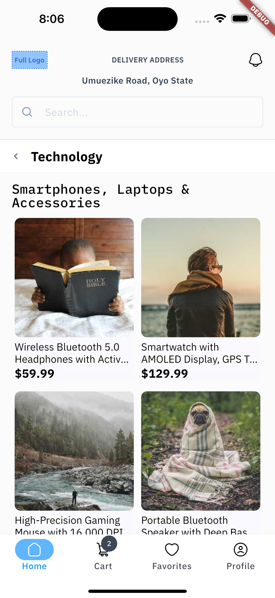
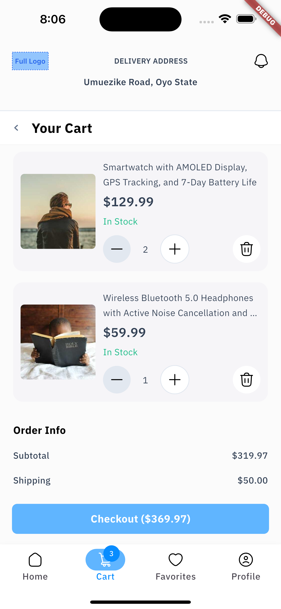
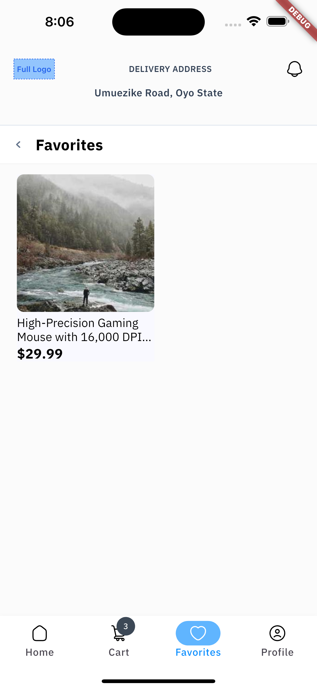
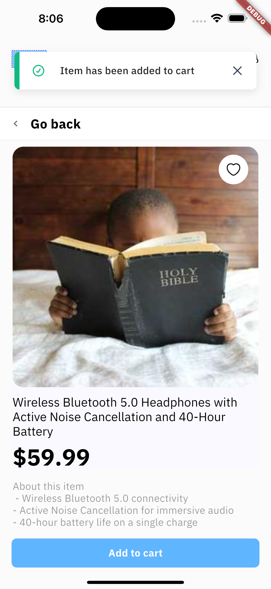

# Mini Mart

A simple Flutter shopping cart application demonstrating state management, persistent storage, and a clean UI.

---

## 🛠️ Tech Stack

| Layer        | Tool/Package                      |
|--------------|-----------------------------------|
| UI           | Flutter, Dart                     |
| State Mgmt   | Riverpod                          |
| Local Storage| Shared_Preferences                |
| Architecture | MVVM (Model-View-ViewModel)       |
| Data Source  | JSON (assets/products.json)       |
| Image        | Network image loading             |

---

## 🚀 Setup & Run Instructions

1. **Clone the repository:**
   ```bash
   git clone https://github.com/oolo/mini_mart.git
   ```
   cd mini_mart
   ```

2. **Install dependencies:**
   ```bash
   flutter pub get
   ```

3. **Run the app:**
   ```bash
   flutter run
   ```

   > _You can run on an emulator or a physical device._

---

## 🖼 Screenshots

| Home Screen <br>  | Cart Screen <br>  | Favorites Screen <br>  | Details Screen <br>  |
|:--------------------------------------------------------------:|:---------------------------------------------------------------:|:---------------------------------------------------------------------:|:-------------------------------------------------------------------:|

---

## 📦 Features

- Browse a list of products
- Add/remove products to/from cart
- Increase/decrease product quantity in cart
- Cart state persists between app launches
- View favorite products
- Add/remove products to/from favorites by tapping the heart icon

---

## 📄 Folder Structure
```
lib
├── core
│   ├── app_router.dart
│   ├── data
│   │   ├── exception.dart
│   │   └── product_data.dart
│   ├── theme
│   │   ├── app_theme.dart
│   │   ├── colors.dart
│   │   └── text_styles.dart
│   └── utilities
│       └── extensions.dart
├── main.dart
├── models
│   ├── cart_item.dart
│   └── product.dart
├── viewmodels
│   ├── cart_provider.dart
│   ├── favorite_provider.dart
│   └── product_provider.dart
└── views
    ├── screens
    │   ├── cart
    │   │   ├── cart_screen.dart
    │   │   └── widgets
    │   │       └── item_card.dart
    │   ├── favorites
    │   │   └── favorites_screen.dart
    │   ├── navigation.dart
    │   └── products
    │       ├── product_details.dart
    │       ├── products_screen.dart
    │       └── widgets
    │           └── product_card.dart
    └── widgets
        ├── app_bar.dart
        ├── buttons.dart
        ├── favourite_icon.dart
        ├── search_bar.dart
        └── title.dart

```
---


